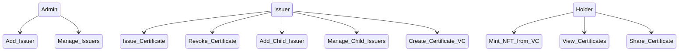
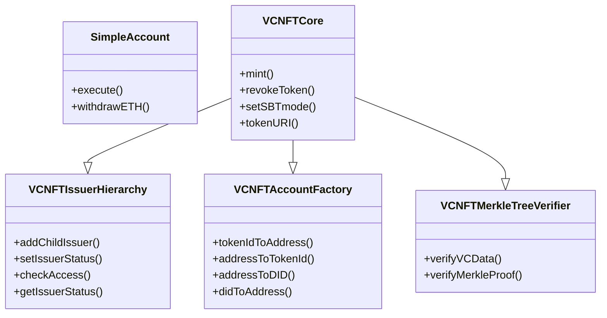

# Digital Certificate Management System with NFT + VC technology

This project is a blockchain-based digital certificate management system built using Scaffold-ETH 2.

special from CraftimWeb team

[hardhat readme](./sc-hardhat/README.md)

# Deployed

Arbitrum Sepolia testnet

VCNFTCore: https://sepolia.arbiscan.io/address/0xCF3DAA1CFfEDdb7243d7BF93A4Be95C95E5d5215

SimpleAccount: https://sepolia.arbiscan.io/address/0xc2458912024E4f29eE662Da3ECC2503bF16480aa


## Project Structure
```
./
├── ansible              # Ansible playbooks
├── backend-express      # Express server for vc creation
├── caddy                # Caddy web server configuration
├── docker               # Docker configuration
├── frontend-next        # Client app
├── sc-hardhat           # Smart contracts hardahat project
```

## Roles and use cases


## Smart contract inheritance
